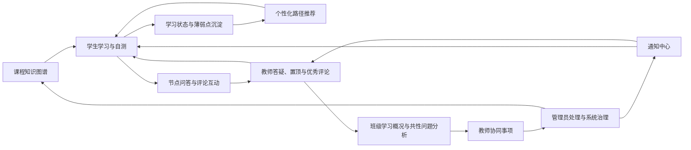
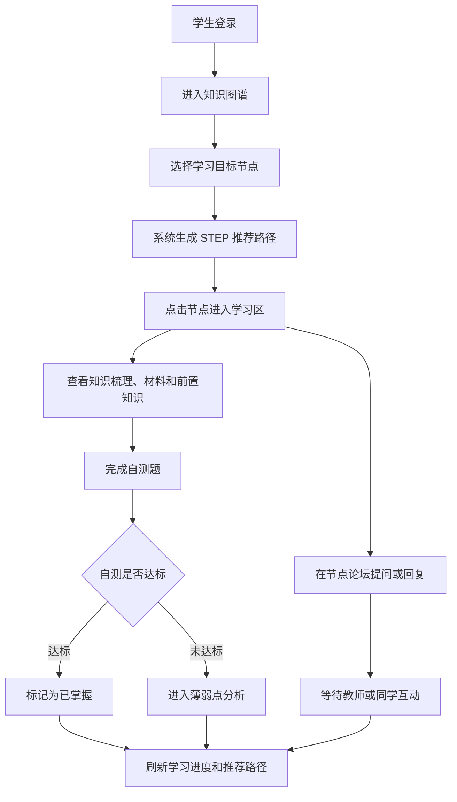
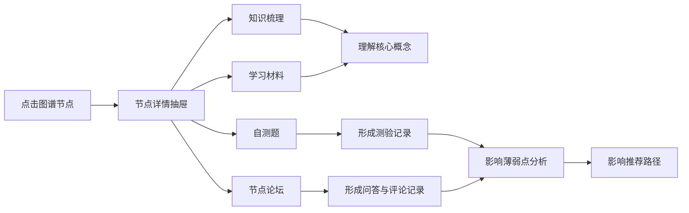
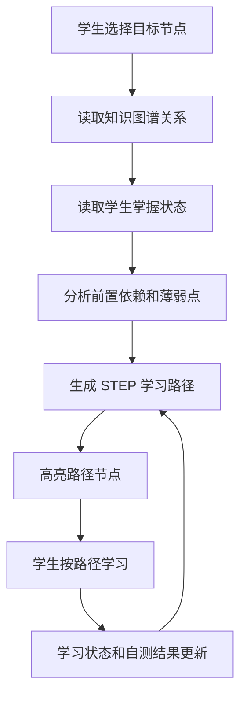
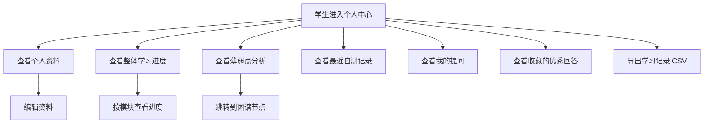
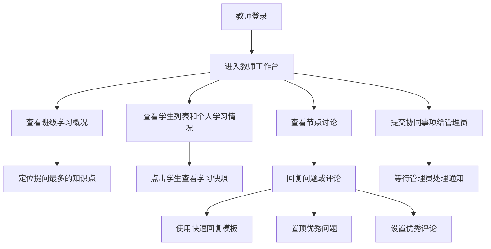
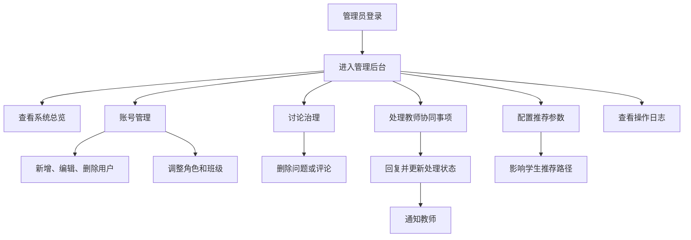
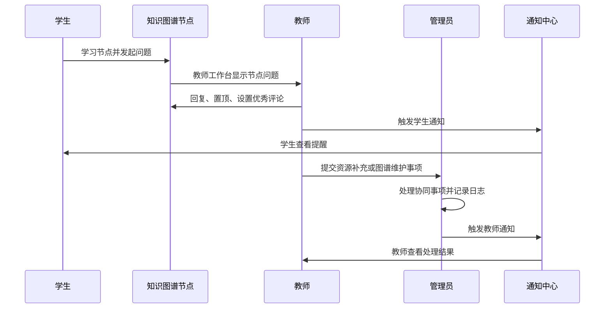

# 业务流程说明

本文档用于说明“基于知识图谱的《人工智能与数字素养》助学系统”的核心业务流。系统围绕知识图谱展开，将学生学习、教师指导、管理员治理连接成一个完整闭环。

## 1. 总体业务闭环

系统的业务主线可以概括为：

业务重点不是单纯展示图谱，而是让“学习行为、问答互动、教学反馈、平台治理”持续反哺知识图谱和推荐结果。

## 2. 游客业务流

游客主要用于系统入口展示和图谱预览。

1. 进入首页，了解系统定位。
2. 点击进入知识图谱页面。
3. 浏览完整课程知识结构，包括节点、关系、前置依赖和相关关系。
4. 尝试点击具体节点时，系统提示登录。
5. 游客可选择注册学生账号或使用已有账号登录。

该流程体现系统的开放性：游客能看到课程整体结构，但个性化学习、节点详情、自测和互动必须登录后使用。

## 3. 学生学习业务流

学生端的核心是“目标选择 - 图谱学习 - 自测验证 - 互动提问 - 推荐更新”。

学生端关键动作：

- 在图谱中查看知识点之间的前置依赖。
- 按节点学习知识梳理、学习材料、视频链接和课堂练习任务。
- 完成每个节点的 10 道自测题。
- 标记掌握状态：未学、学习中、已掌握。
- 根据目标节点生成 `STEP 1 / STEP 2 / STEP 3` 后续学习路径。
- 查看优先学习节点和薄弱点分析。
- 在节点论坛发起问题、回复评论、点赞评论。
- 收藏教师置顶的优秀回答。
- 在个人中心查看学习进度可视化、模块进度、自测记录和提问记录。

## 4. 节点学习区业务流

每个知识点节点都被设计成一个小型学习单元。

节点详情区包含：

- 节点说明：名称、分类、难度、建议学习时长、内容来源。
- 前置知识点：学习当前节点前建议先掌握的内容。
- 可解锁知识点：完成当前节点后可继续学习的后续节点。
- 知识梳理：核心要点、文字讲解、学习提示、常见误区。
- 学习材料：图示材料、视频检索链接、课堂练习任务。
- 自测题：判断题和选择题混合，达标后可标记为已掌握。
- 节点论坛：学生提问、多人回复、楼中楼评论、点赞、优秀评论和教师置顶。

## 5. 推荐路径业务流

推荐路径基于知识图谱前置依赖和学生掌握状态生成。

推荐依据包括：

- 目标节点是否已掌握。
- 前置节点是否完成。
- 学生当前学习中节点。
- 未掌握且影响后续节点较多的薄弱点。
- 自测错误率和提问次数。

推荐结果展示在知识图谱页顶部，学生可以直接点击 `查看节点` 进入对应学习区。

## 6. 学生个人中心业务流

个人中心不再承担推荐路径展示，重点改为学习数据归档和学习进度反馈。

该业务流的价值是让学生能看到自己“学了什么、哪里薄弱、下一步该去哪里复习”。

## 7. 教师教学业务流

教师端的核心是“查看班级学习情况 - 处理节点问题 - 沉淀优秀讨论 - 向管理员协同”。

教师端关键功能：

- 查看班级学生数、平均进度、平均掌握节点数。
- 查看提问最多的前 5 个知识点。
- 查看学生个人学习快照，包括掌握节点、薄弱点、提问情况。
- 回复学生在节点论坛中的问题。
- 使用快速回复模板提高答疑效率。
- 置顶优秀问题，让学生在节点学习区优先看到。
- 将优质回复设为优秀评论。
- 向管理员提交图谱内容维护、资源补充、权限调整或系统支持事项。
- 导出班级问答统计 CSV。

## 8. 管理员治理业务流

管理员端的核心是“账号管理 - 内容治理 - 协同处理 - 参数配置 - 日志追踪”。

管理员端关键功能：

- 查看用户数量、角色分布、图谱节点数量、关系数量。
- 新增、修改、删除用户账号。
- 修改用户角色、班级编号、姓名、学校、专业、年级、班级名和密码。
- 查看讨论治理数据，包括置顶讨论数、已回复问题数、优秀评论数和评论获赞数。
- 删除不合适的问题或评论。
- 处理教师提交的协同事项，并通过通知中心回流结果。
- 配置推荐算法参数，如推荐数量、薄弱点数量、路径长度上限和权重。
- 查看管理员操作日志，体现平台治理和可追溯性。

## 9. 多角色协同业务流

系统中三个角色并不是孤立使用，而是围绕同一张知识图谱进行协同。

典型协同场景：

- 学生在“机器学习”节点提问，教师回复并置顶，其他学生点赞和继续评论。
- 教师发现“大模型基础”节点提问较多，向管理员提交资源补充请求。
- 管理员处理请求，补充说明或更新配置，并产生通知。
- 学生重新进入图谱页，推荐路径和薄弱点分析根据最新学习记录更新。

## 10. 演示业务流建议

答辩或课堂演示时，可以按以下顺序展示：

1. 游客进入首页和知识图谱，点击节点时提示登录。
2. 使用学生账号 `test_stu1 / test` 登录。
3. 查看图谱顶部推荐学习路径，点击一个 `STEP` 节点。
4. 在节点详情中展示知识梳理、学习材料、自测题和节点论坛。
5. 在个人中心展示学习进度可视化、薄弱点和自测记录。
6. 使用教师账号 `test_tea1 / test` 登录。
7. 查看班级学习概况、热门提问知识点、学生快照和节点讨论。
8. 教师回复问题、置顶问题或设置优秀评论。
9. 使用管理员账号 `test_adm1 / test` 登录。
10. 展示账号管理、讨论治理、协同事项、推荐参数和操作日志。

这一演示顺序能够覆盖“学习 - 教学 - 管理 - 通知 - 数据治理”的完整业务闭环。

